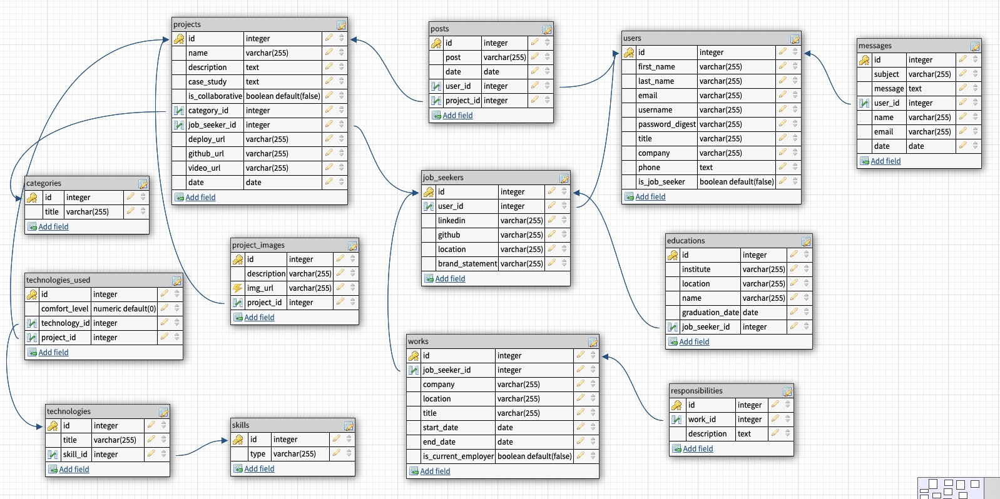

# Portfolio
Shirley Hastier Portfolio Website

### Schema diagram

## Wireframes and user stories
### API
#### Projects
GET api/portfolio/projects
- Get all projects

GET api/portfolio/projects/:id
- Get project with that id

GET api/portfolio//projects/categories
- Get all projects by categories

GET api/portfolio//projects/categories/:id
- Get all projects by that category

#### Contact Me
POST api/contact
- Submit contact form.

#### A user will be able to:
* Register and post a comment on any project.  
* Like a project, it will be shown on it's dashboard. 
* Submit a contact form, it will be shown on it's communication channel.
* User shastier: will be able to update, add and delete projects / skills

## Technologies used
- **FrontEnd React**
- **Node and Express**

## References:
- Showcase work of "Web Creek" technology solutions provider.
https://www.webcreek.com/en/our-work/ 

- Example Portfolio, a GA alumni.
http://work.megancoyle.com/

- Website portfolio template 
https://startbootstrap.com/previews/freelancer/

- Deployment(Amazon Web Services)
https://aws.amazon.com/
